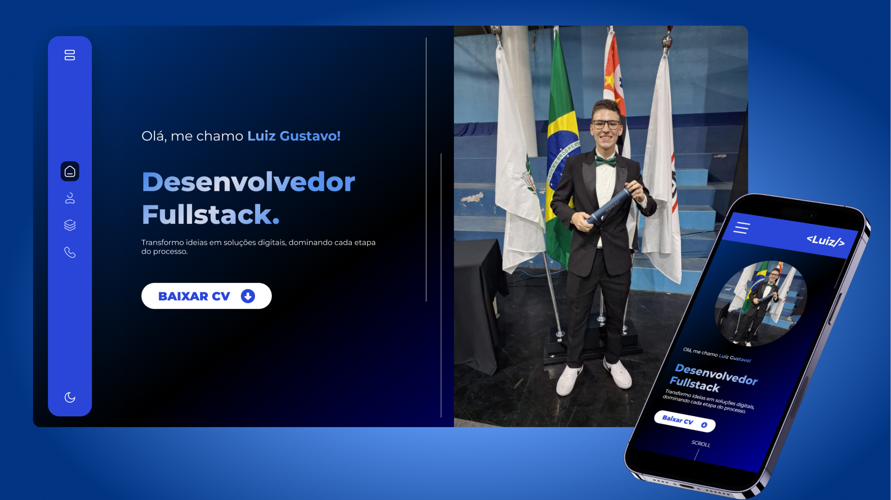

# 🗂️ Meu Portfólio

Bem-vindo ao repositório do meu portfólio pessoal! Este projeto foi criado para apresentar minha trajetória como desenvolvedor Full-Stack, destacar os projetos em que trabalhei e as tecnologias com as quais tenho experiência.

## 🛠️ Tecnologias

- React
- HTML
- CSS
- JavaScript
- Vite

## 🚀 Funcionalidades

- <b>Home:</b> A seção inicial do meu portfólio, mostrando meu foco na área e um imagem minha;
- <b>Sobre Mim:</b> Uma breve descrição da minha jornada como profissional e estudante de programação, mostrando as principais tecnologias que utilizo;
- <b>Projetos:</b> Visualização dos projetos que desenvolvi, incluindo detalhes sobre as tecnologias utilizadas.
- <b>Contatos:</b> Uma seção dedicada para que visitantes possam facilmente entrar em contato comigo.